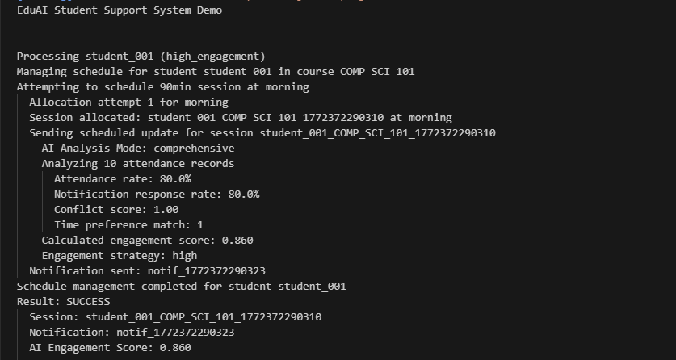
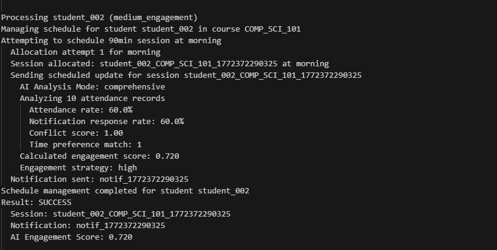
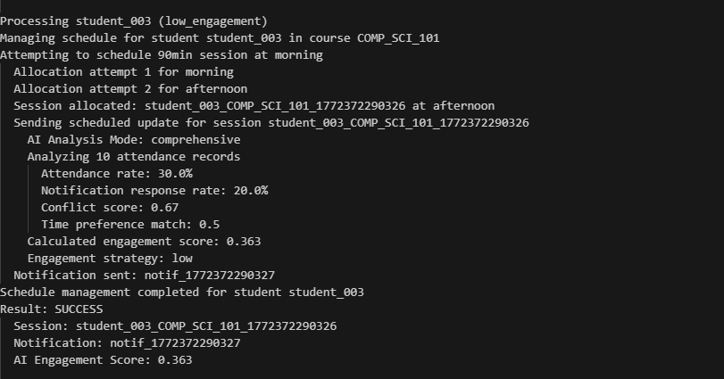
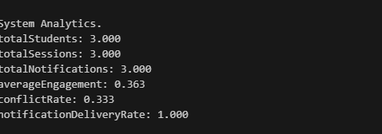

## EduAi

A school management system with AI functionality.

# Constructor

```js
  constructor() {
    this.students = new Map();
    this.sessions = new Map();
    this.notifications = [];
    this.aiModels = {
      engagementPredictor: this.initializeEngagementModel(),
      scheduleOptimizer: this.initializeScheduleModel(),
    };
    this.systemMetrics = {
      totalNotifications: 0,
      engagementScore: 0,
      schedulingConflicts: 0,
    };
  }

```

# Student Schedule Mngt

```js
manageSchedule(studentId, courseId, (preferences = {}));
```

# Screenshots

Sample Output 1



Sample Output 2



Sample Output 3


System Analytics.


